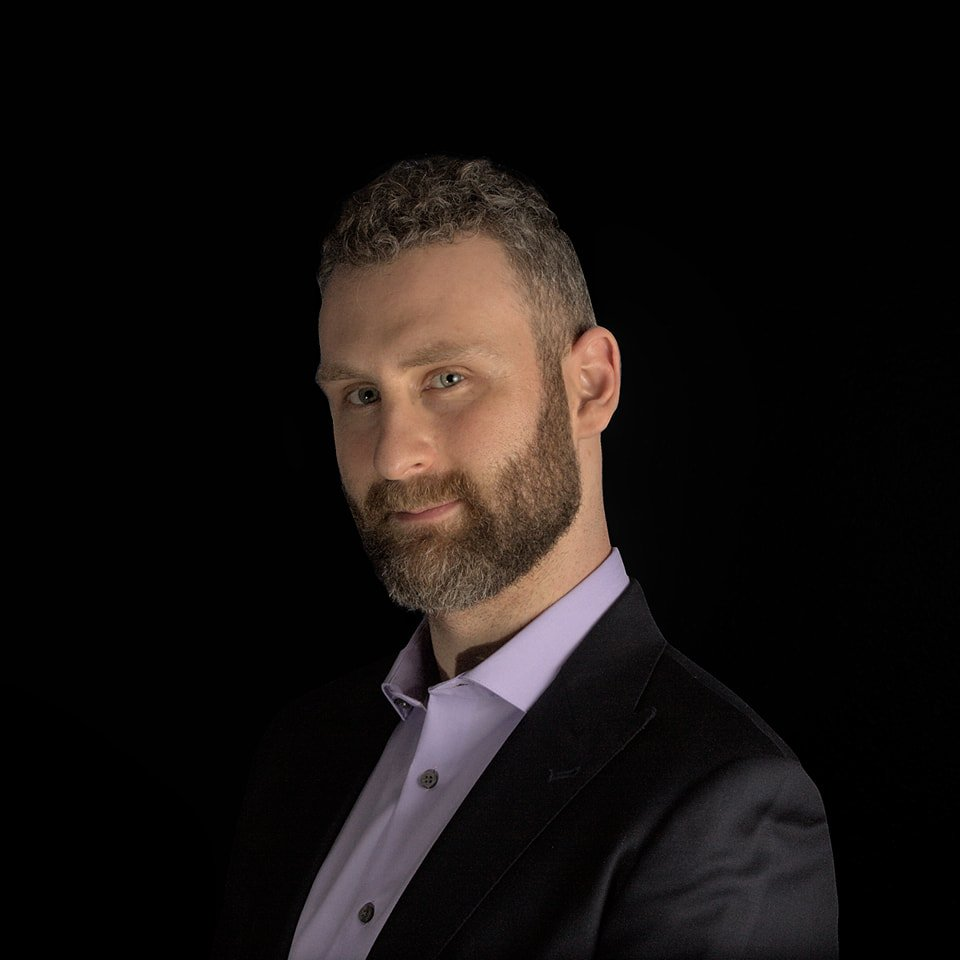
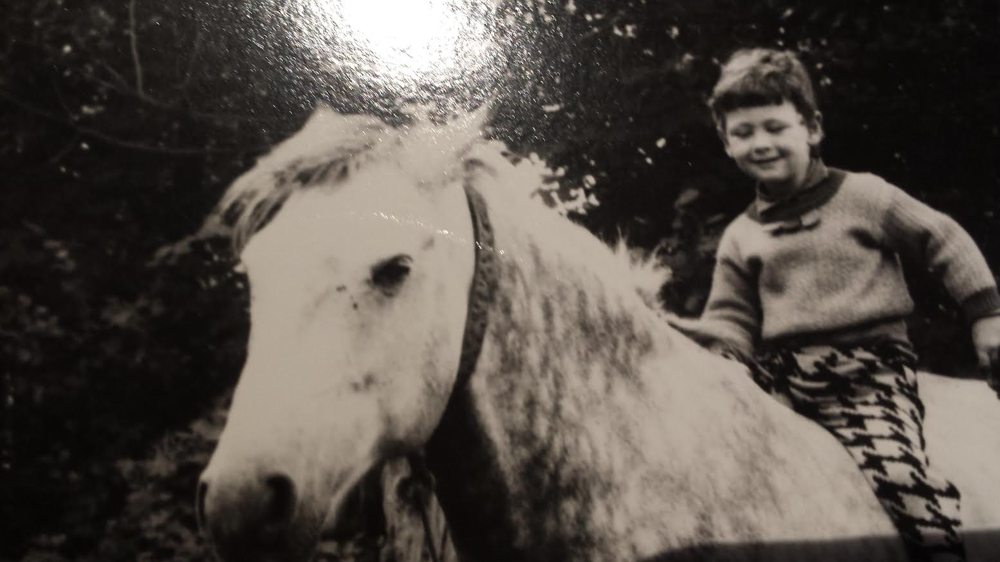
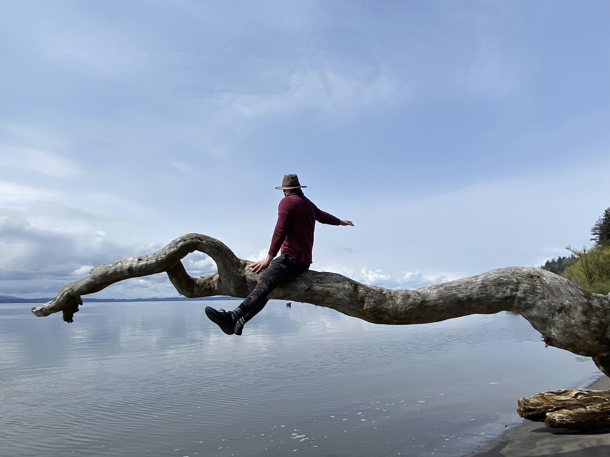
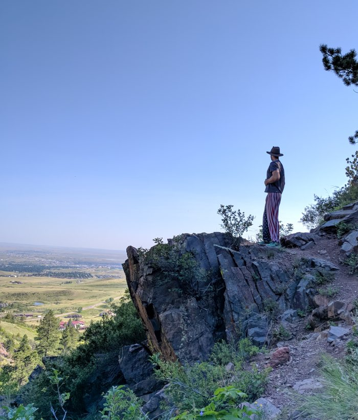
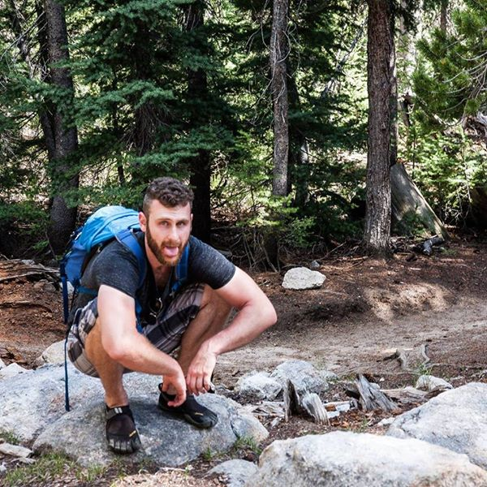
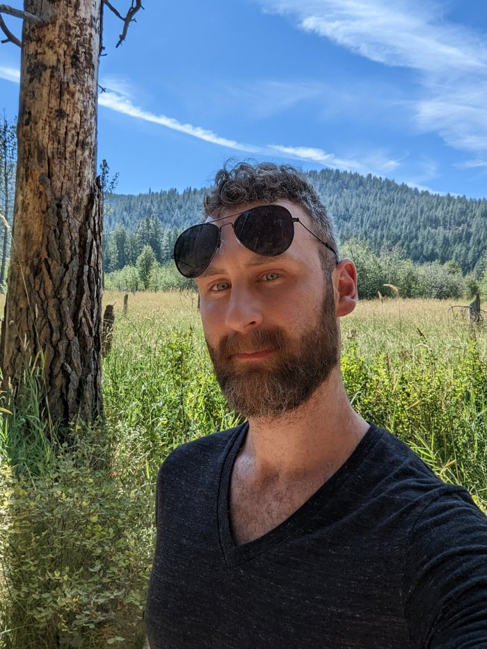
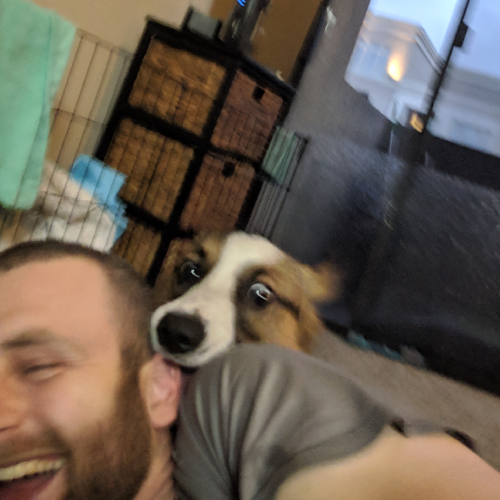

::: {.about-page .has-net}

::: {.about-layout}
::: {.about-photo}
{fig-alt="Portrait of Dmitriy Leybel"}
{fig-alt="A childhood photo on horseback"}
:::

::: {.about-copy .frost-pane}
Born in Kiev, Ukraine. Moved to Los Angeles at five and stayed for a couple of decades of pleasant weather before Oregon. AI/ML engineer, data scientist, statistician.

I work on knowledge systems and language models — building them, teaching them, and deciding when not to use them. Consultancy is [Prudent Patterns](https://prudentpatterns.com){.ink-link}; the writeups live on this site.

::: {.about-meta}
These days I build systems, write about them here, and get outside when I can.
:::
:::
:::

Otherwise

I absolutely love the outdoors and try to get out as often as possible. Sometimes the laptop comes along for the ride, but usually not.

::: {.photo-strip}
{.lightbox fig-alt="Sitting on a fallen tree over water"}
{.lightbox fig-alt="Outdoors"}
{.lightbox fig-alt="Hiking"}
{.lightbox fig-alt="In the woods"}
:::

::: {.about-aside .frost-pane}
{fig-alt="Dmitriy with a corgi"}

I am also an avid enjoyer of Corgis. A *corgoisseur*, one may say.
:::

:::
