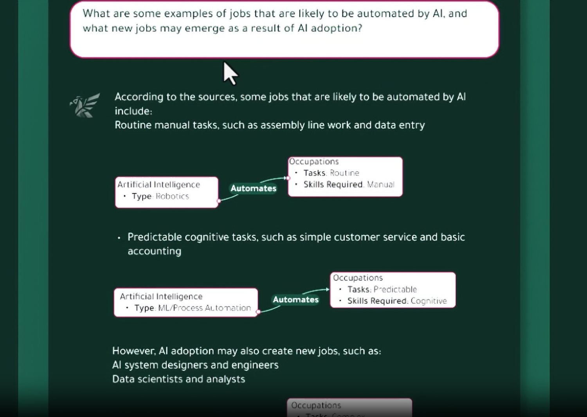

## Problem

Asking a model about a corpus without structure gives you fluency without a trail. The useful unit of memory is not the whole document dump — it is the graph of what the question actually depends on.

## How it works

Hippograph is a portmanteau of *hippocampus* and *graph*, and a play on *hippogriff*. It uses knowledge graphs as structured memory over a corpus: deconstruct first, then ask with sources.

It is easier demo'd than said — there is a video on [the site](https://hippograph.io). The long writeup is the [KG-RAG series](../../technical_blog.qmd#kg-rag) on the technical blog.

{fig-alt="Hippograph answering a question with a knowledge graph"}

## Who it is for

Anyone who needs answers that can point back at a structured representation of a corpus, not just a nearest-neighbor chunk.

## Links

- [hippograph.io](https://hippograph.io)
- [Technical series](../../technical_blog.qmd#kg-rag)
