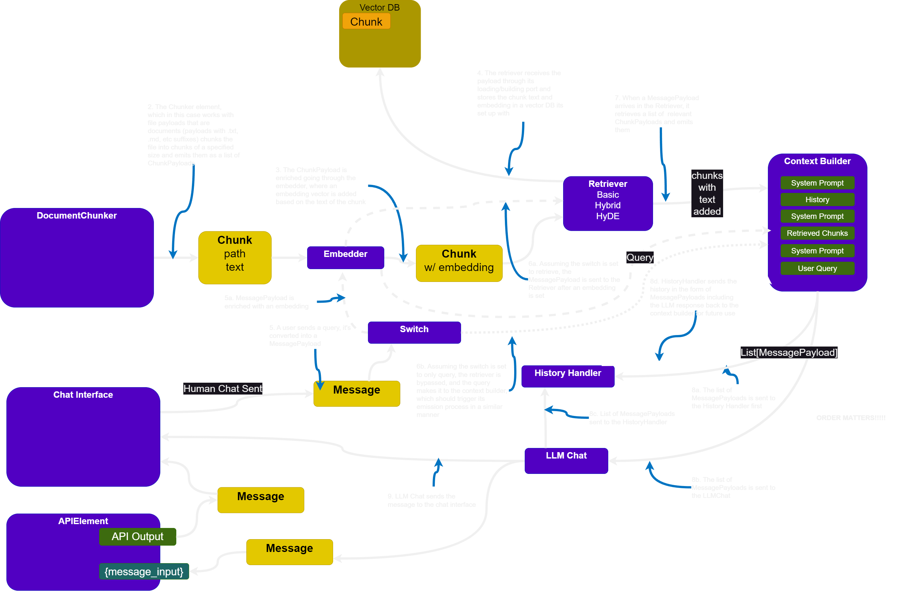
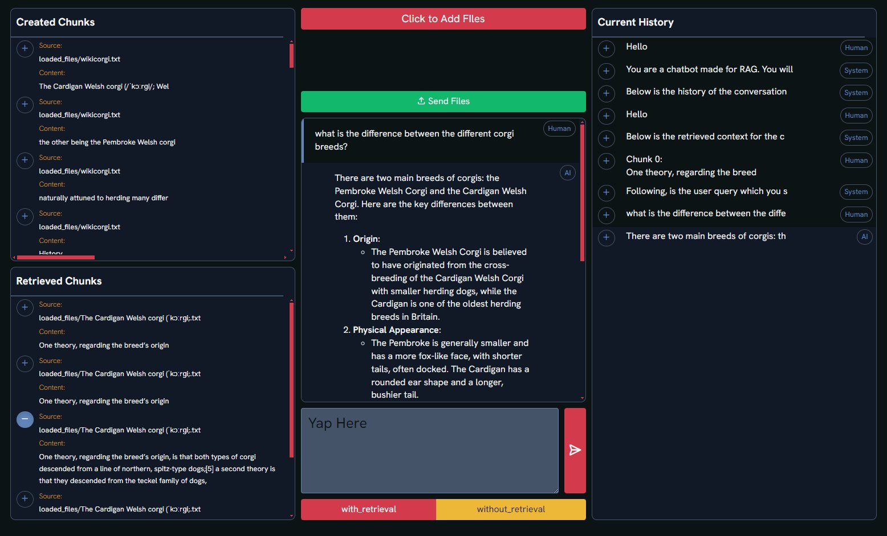

## Problem

Building an LLM app usually means re-deriving the same chassis: a chat loop, a retrieval path, a place to hang an API. Those pieces should compose, not restart from a blank file each time.

## How it works

Pyllments is a Python workbench for composing LLM applications from *elements*. Combine them into a flow and the same setup can be a chatbot, a RAG system, or an API over that workflow — attach API elements that trigger and capture results from any specified element.

The point is iteration: modularity, composability, and a UI you can stand up without a separate frontend project.

{fig-alt="Pyllments RAG flow diagram"}

{fig-alt="Pyllments interface"}

## Who it is for

People who want a Python-first way to try LLM use cases without committing to a full product scaffold on day one.

## Links

- [GitHub](https://github.com/Prudent-Patterns/pyllments)
